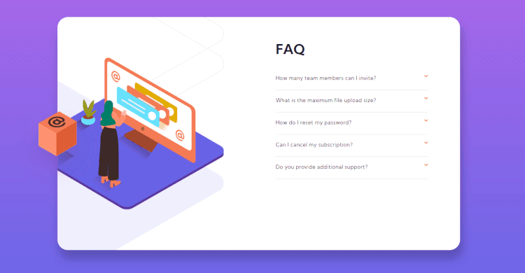

# Frontend Mentor - FAQ accordion card solution

This is a solution to the [FAQ accordion card challenge on Frontend Mentor](https://www.frontendmentor.io/challenges/faq-accordion-card-XlyjD0Oam). Frontend Mentor challenges help you improve your coding skills by building realistic projects. 

## Table of contents

- [Overview](#overview)
  - [The challenge](#the-challenge)
  - [Screenshot](#screenshot)
  - [Links](#links)
- [My process](#my-process)
  - [Built with](#built-with)
- [Author](#author)

## Overview

### The challenge

Users should be able to:

- View the optimal layout for the component depending on their device's screen size
- See hover states for all interactive elements on the page
- Hide/Show the answer to a question when the question is clicked

### Screenshot

- Mobile

- Desktop

### Links

- Solution URL: [Solution on Frontend Mentor](https://www.frontendmentor.io/solutions/faq-accordion-card-f27Tg9MGQ)
- Live Site URL: [Live View on Netlify](https://kind-swirles-ea2486.netlify.app)

## My process

### Built with

- Mobile-first workflow
- Semantic HTML5 markup
- CSS custom properties

## Author

- Github - [@wesleybs90](https://github.com/wesleybs90)
- Frontend Mentor - [@wesleybs90](https://www.frontendmentor.io/profile/wesleybs90)
